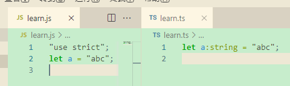
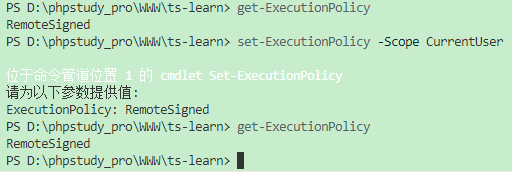
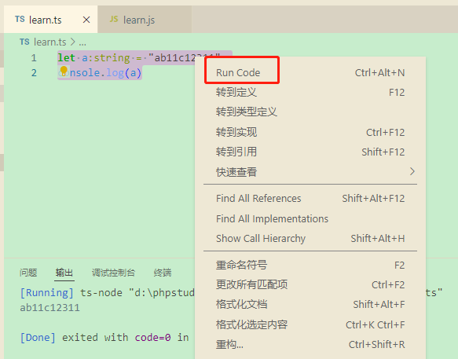
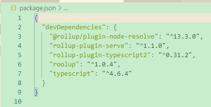
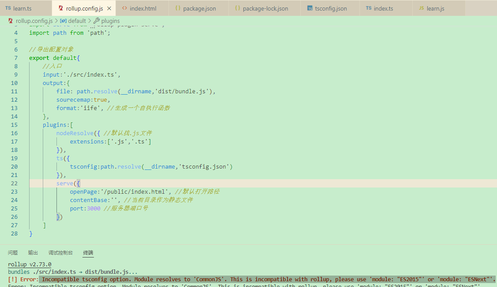
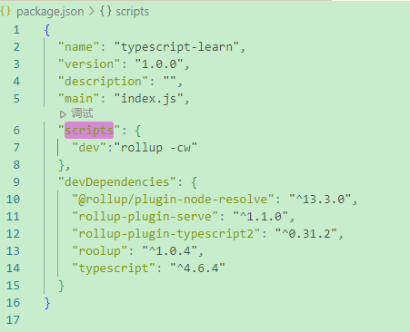

# TS学习文档 #

## 什么是TS ##
TypeScript--遵循ES7、ES6、ES5语法规范

TypeScript是JavaScrpit的超集，扩展了JavaScript语法

- TypeScript更像后端JAVA让Js可以开发大型企业应用

- TS提供的类型系统可以帮助我们在写代码时提供丰富的语法提示

- 在编写代码时会对代码进行类型检查从而避免很多线上错误

## 环境配置及编译 ##
1. **全局编译TS文件**

全局安装typescript对TS进行编译

        npm install typescript -g
    	tsc --init #生成tsconfig.json

PS. tsc不是内部命令报错--配置全局变量
    
   执行 npm install 的时候 就会自动生成package-lock.json文件
    
step1.新建系统变量

    变量名: NODE_PATH
    
    变量值: npm目录路径/nodejs路径（dos输入npm config get prefix 可以直接获取npm的路径 ）
step2.找到 用户变量 和 系统变量 里的 path , 在末尾添加上 %NODE_PATH%

**tsconfig.json**--文件中存放编译选项--TypeScript编译为JavaScript

2.**文件编译**

①.新建ts文件使用ts语法编写之后 cd到对应文件夹下 使用 **tsc** 命令将ts文件转为js文件（手动版）

vscode终端输入tsc编译命令报错

tsc : *无法加载文件 F:\npm_resouse\tsc.ps1，因为在此系统上禁止运行脚本*

**解决**

1.管理员身份运行vs code

2.在终端执行：get-ExecutionPolicy，显示Restricted

3.在终端执行：set-ExecutionPolicy(不可以的话换set-ExecutionPolicy -Scope CurrentUser)  后 RemoteSigned

4.在终端执行：get-ExecutionPolicy，显示RemoteSigned

②.vscode中使用 **tsc-w** 命令，可以让.ts文件保存之后实时自动转换成.js文件

3.**不想编译，想直接运行ts文件**

①.vscode安装code-runer 

②.npm安装包 ts-node

	//有这个包之后才可以调用code-runner运行ts文件
    npm install ts-node -g

## 构建工具搭建TS解析环境 ##

1.**rollup构建ts**

①.初始化

    npm init -y //生成package.json 记录项目中的依赖包

②.安装roolup
    
    npm install roolup typescript rollup-plugin-typescript2 @rollup/plugin-node-resolve rollup-plugin-serve -D
    # rollup -- 打包的
    # typescript -- ts编译成js的
	# rollup-plugin-typescript2 -- rollup跟ts关联
    # @rollup/plugin-node-resolve -- 解析第三方模块
    # rollup-plugin-serve -- 启动本地环境

③.新建rollup配置文件 rollup.config.js

**ps.**运行 npm run dev报错如上图(dev 为package.json的scripts配置项)

①.package.json 文件有一个 scripts 字段，可以用于指定脚本命令，供 npm 直接调用。

注：npm run 为每条命令提供了** pre-** 和** post-** 两个钩子（hook）。以 npm run test 为例，如果我们的 scripts 字段规定了 pretest 和 posttest：

则会先执行 pretest 任务，再执行 test 任务，完成 test 任务后即执行 posttest 任务。
可以简单的将二者理解为：预执行、后执行；

--**npm**的全称是**Node Package Manager** -- Nodejs软件包管理工具

解决：更改配置文件tsconfig.json中module为ESNEXT

①.es6

ES6就是ECMAScript6是新版本JavaScript语言的标准，它的目标是使得JavaScript语言可以用来编写复杂的大型应用程序，成为企业级开发语言。15年发布

##  TS语言学习  ##
1.**基础数据类型**

**ps.枚举跟数组**

枚举是标签（定死的），数组是容器（存放数据）

枚举是值类型，数组是引用类型

枚举是常量的集合，数组是变量的集合

枚举对象在任一时刻只能有一个常量值，数组对象在任一时刻可以有多个值

**枚举的目的：**
比如说你现在声明一个变量
string week ;要给它赋值，很明显它的值应该是从星期一到星期日，也就是说你只能给它赋这七个中的一个才有意义。
为了防止用户录入了错误的信息，设置了枚举变量，规定只能选择此变量中的一个值。
其实这符合微软的一个通常的做法：能不让用户自己录入信息的一般都给出了一大堆的范围，让我们自己选择。

//基础数据类型
//声明一个变量: ts类型 = 值

    let num:number = 10;
    let str:string = "string";
    let bool:boolean = false;

//元组 标识长度是固定的，内容跟类型也规定好

    let tuple:[string,number,boolean] = ['string',18,true];
    let n = tuple[1]
    //无法通过索引给元组添加不存在的属性
    //tuple[3]=100

//如果通过数组方法新增，必须元组中得支持此类型

    tuple.push('zf');
    let r = tuple.pop(); //pop()拿掉最后一项 赋值之后r值就为最后一项
    console.log(r)

//数组类型：存放一类类型

    let arr:number[] = [1,2];
    let arr1:(number | string)[] = [1,'2'] //联合类型(number | string)
    let arr2:Array<number|string> = [1,"2",2] //泛型
    let arr3:any[] = [1,'2',{}] //任何类型不进行类型校验(最好不用)

//枚举类型 -- 一类类型放到一起 枚举中的默认值从0开始 只有数字才可以自行进行推算
//应用 -- 状态码、权限、类型...

    enum USER_ROLE{
    USER = "abc",
    ADMIN = 0,
    MANAGER
    }
//如果枚举中的值是数字，那么可以反举 
//USER_ROLE[2]可以 & USER_ROLE['abc']不行
//异构枚举，枚举中存放了不同类型 
//ts枚举编译出来的结果是个对象

    console.log(USER_ROLE.ADMIN) //输出1
    
    const enum STATUS_CODE{
    NOT_FOUND
    }
//常亮枚举不会进行编译

//null 和 undefined
//是任何类型中的子类型，在严格模式下 null->null undefined->undefined

//void 类型， 一般用于函数的返回值，在一般情况下只接受null或者undefined
//在非严格模式下 null可以赋值给任何类型，严格模式下 null不能赋值给void

    function af():void{
    return undefined;
    }

//never类型 永远达不到的类型,never是任何类型的子类型
//1) 报错  2)死循环 3)判断的时候永远进不到某个判断

    function myError():never{
    throw new Error();
    }
    bool = myError();
    
    function whileTrue():never{
    while(true){}
    }
    
    function byType(val:string){
    if(typeof val == "string"){
    val
    }else{
    val
    }
    }

